# DialogUtil
common used dialog with material style ( in support v7)，ios style，get top activity automatically,can invoke show() everywhere (any thread , any window)

[](https://jitpack.io/#hss01248/DialogUtil)

[中文文档](README-ch.md)
<br>
any problem or bug, join the qq group to get a quick response:
<br>
<a target="_blank" href="//shang.qq.com/wpa/qunwpa?idkey=76d7e8396ae225861d714b7f1bb976e1a06c8a76cc35c532c113e892b2d49ff0"></a>

# important points

* if you do not invoke setActivity(activit), please  invoke show() after in or after the activity onResume,or it may show in previous activity!
* about BadWindowTokenException,see the blog:[关于dialog,PopupWindow,SoftInputBoard的弹出时机的问题](http://www.jianshu.com/p/bd98cee2854b)
* if some chinese phone do not show dialog ,please invoke  setActivity(activit)
* do not abuse loadingdialog:


> the right usage is :

```
 fist into the page/activity/fragment,use the loadingview inside your layout/xml,there is many statelayout lib,or you can use my: https://github.com/hss01248/PageStateManager
 refresh a part of the contentView,or click a button to request http,which has no effect on the whole contentview,then you can use the loadingDialog, just like the ajax in web.
```

# features

* include commo dialogs with material style ( in support v7)，ios style
* support  custom dialog ,just deliver a view


* get the top activity automatically ,so no need to deliver the activity , but you also can  invoke setActivity(activit) if in oncreate()
* when the content is fullScreen ,it can adjust the margin automatically
* also can set the height percent and width percent
* has a shadow backgroud incase of the dimlayer not work,you can also disable it to show your own background in customview
* chained api, easy to use
* adapt to phone and tablet,high and low  resolution ratio screen 


# effect pics

ios  style - loading

```
buildLoading( )
buildLoading( CharSequence msg)

updateLoadingMsg(final String msg)
```

 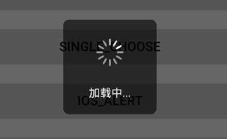

android style-loading

```
buildMdLoading( )
buildMdLoading( CharSequence msg) 

updateLoadingMsg(final String msg)
```

  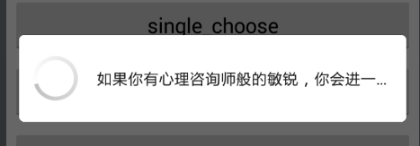

ProgressDialog of horizontal

```
buildProgress( CharSequence msg,boolean isHorizontal)


updateProgress(final Dialog dialog, final int progress, final int max, final CharSequence msg, final boolean isHorizontal)
```

 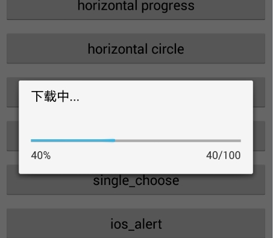

ProgressDialog of spinner

 

AlertDialog of appcompat-v7

```
buildMdAlert( CharSequence title, CharSequence msg, MyDialogListener listener)
```

 


```
buildMdSingleChoose( CharSequence title, int defaultChosen, CharSequence[] words, MyItemDialogListener listener)
```

 

```
buildMdMultiChoose( CharSequence title, CharSequence[] words, List<Integer> selectedIndexs, MyDialogListener btnListener)
```

 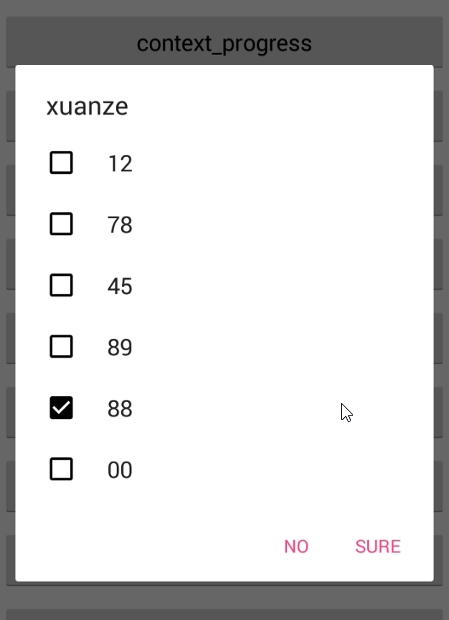


ios style

```
buildIosAlert( CharSequence title, CharSequence msg, MyDialogListener listener)
```

 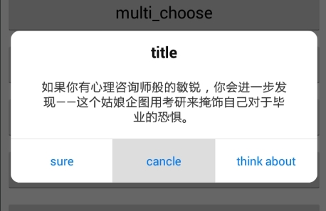


```
buildIosAlertVertical( CharSequence title, CharSequence msg, MyDialogListener listener) 
```

 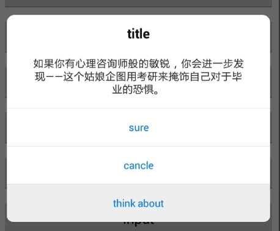

```
buildNormalInput( CharSequence title, CharSequence hint1, CharSequence hint2, CharSequence firstTxt, CharSequence secondTxt, MyDialogListener listener
```

 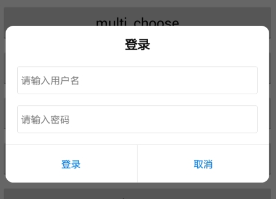


```
buildIosSingleChoose( List<? extends CharSequence> words, MyItemDialogListener listener)
```

 

```
buildBottomItemDialog( List<? extends CharSequence> words, CharSequence bottomTxt, MyItemDialogListener listener)
```

 


BottomSheetDialog of design

```
buildBottomSheetLv(CharSequence title, List datas, CharSequence bottomTxt, MyItemDialogListener listener)
```

  


```
buildBottomSheetGv( CharSequence title, List datas, CharSequence bottomTxt,int columnsNum ,MyItemDialogListener listener)
```

 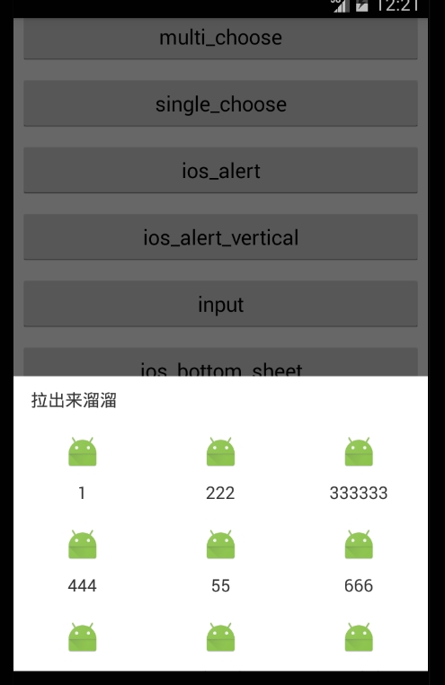


gridview拉出来时:

 


 show a custom view:( the demo below contains a webview)

```
 ViewGroup customView = (ViewGroup) View.inflate(this,R.layout.customview,null);
final ConfigBean bean = StyledDialog.buildCustom(customView, Gravity.CENTER);
final Dialog dialog1 =   bean.show();
```

 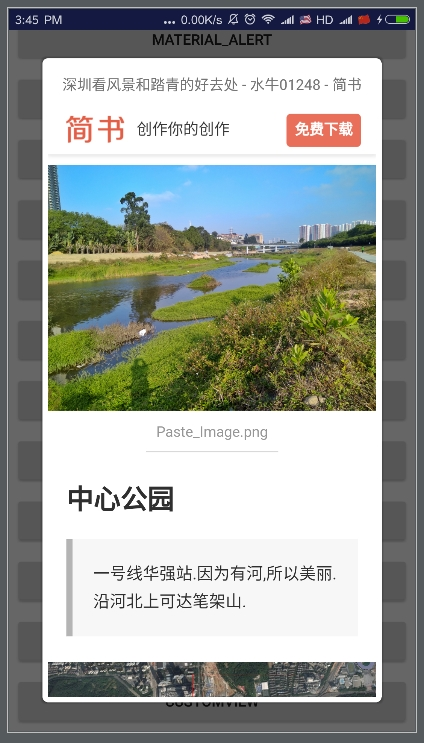


# screen adapt


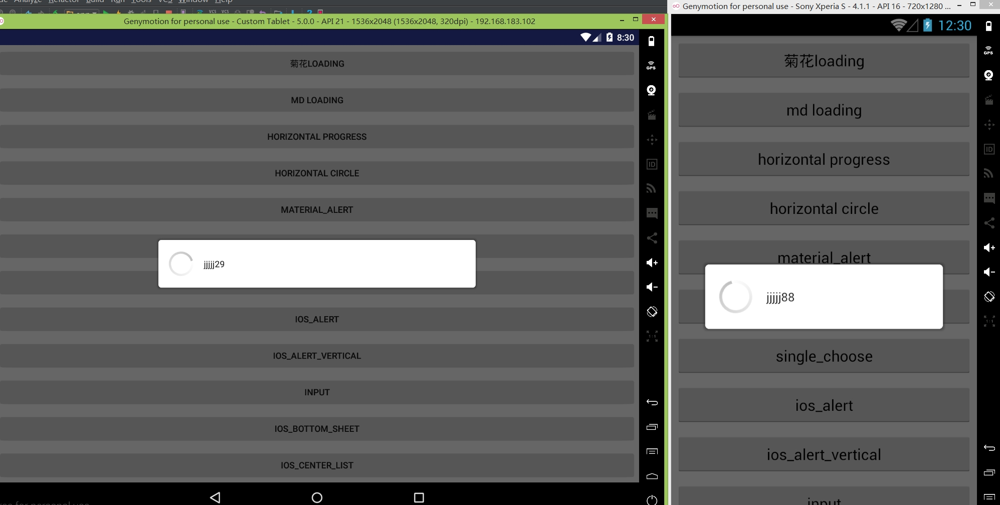


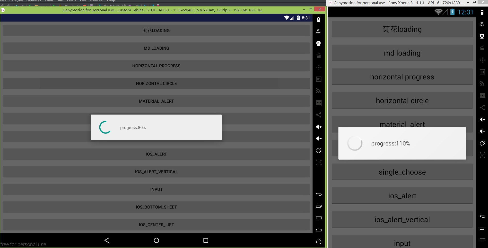


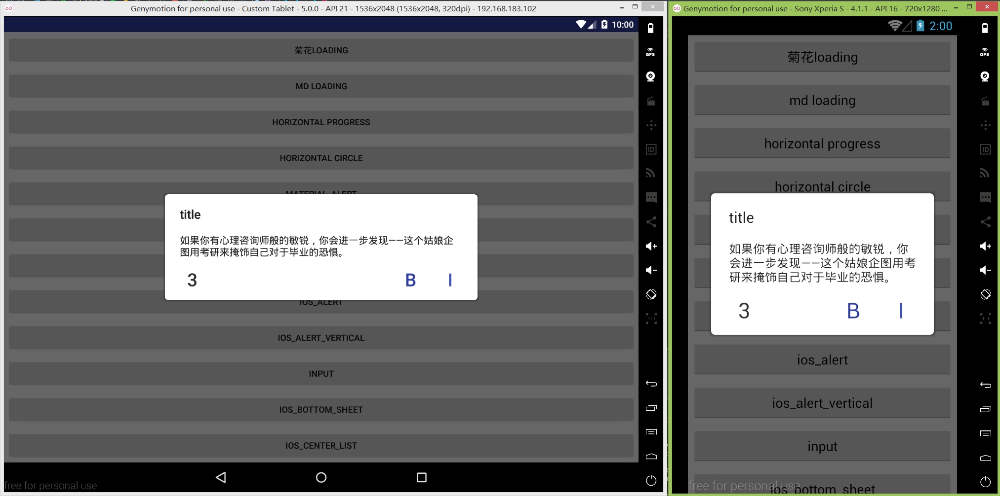


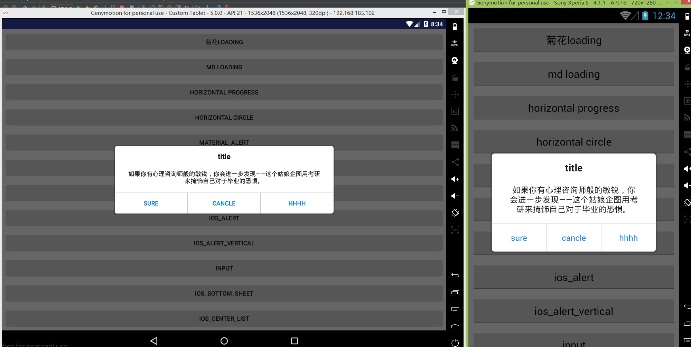


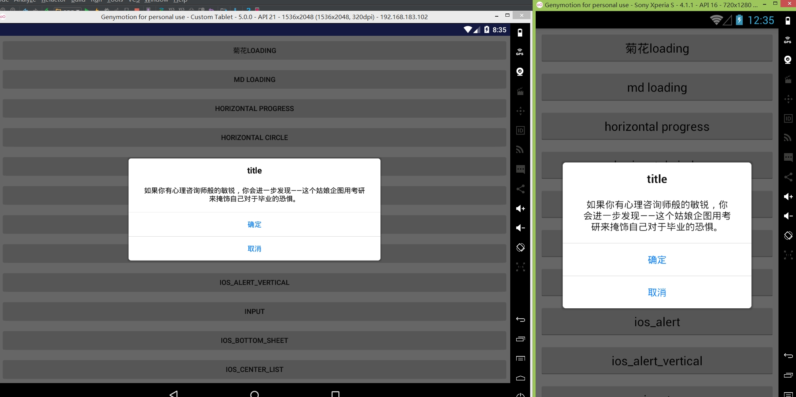


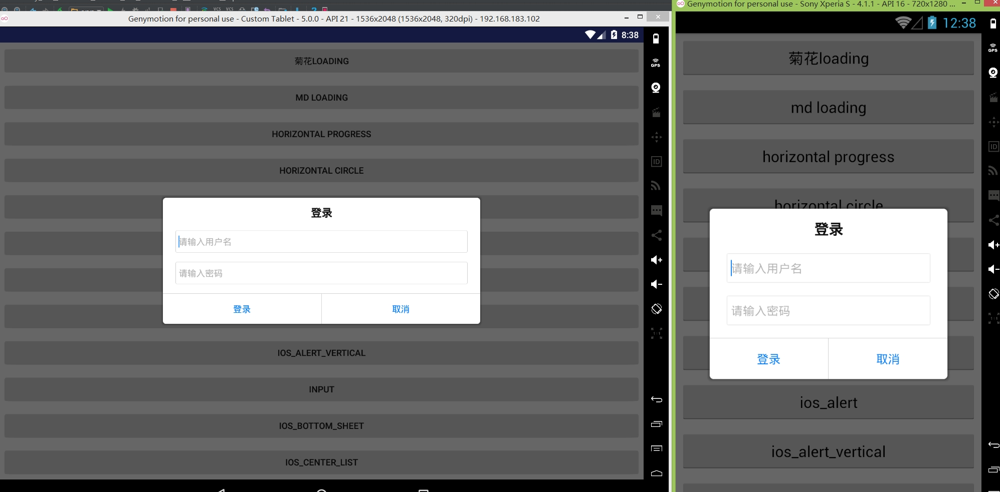


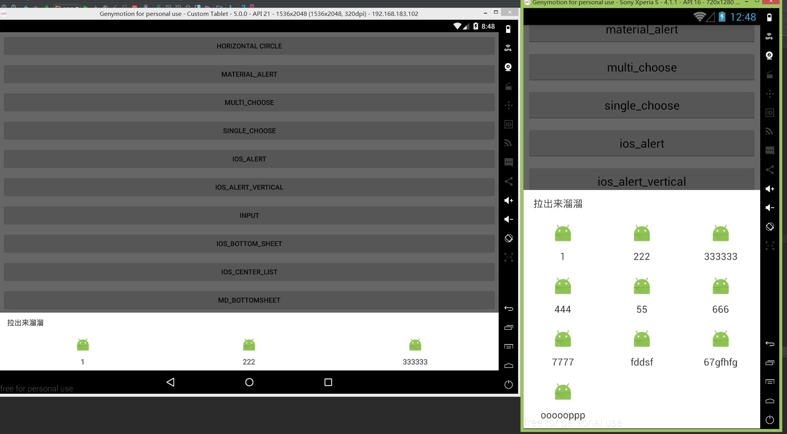

> if do not need the haf transparent layer(by setTransparentBehind(true),or the haf transparent layer(dimlayer) do not funtion well,the shadow effect show as below :


# useage


## gradle

**Step 1.** Add the JitPack repository to your build file

Add it in your root build.gradle at the end of repositories:

```
	allprojects {
		repositories {
			...
			maven { url "https://jitpack.io" }
		}
	}
```

**Step 2.** Add the dependency

```
	dependencies {
	        compile 'com.github.hss01248:DialogUtil:lastest release'
	}
```
lastest release: https://github.com/hss01248/DialogUtil/releases

## init

```
//in oncreate() of BaseApplication:

StyledDialog.init(this);

get activity instance in ActivityLifecycleCallbacks:
 registerActivityLifecycleCallbacks(new ActivityLifecycleCallbacks() {
            @Override
            public void onActivityCreated(Activity activity, Bundle savedInstanceState) {

            }

            @Override
            public void onActivityStarted(Activity activity) {

            }

            @Override
            public void onActivityResumed(Activity activity) {
            	//keep a softReference inside
                MyActyManager.getInstance().setCurrentActivity(activity);

            }

            @Override
            public void onActivityPaused(Activity activity) {

            }

            @Override
            public void onActivityStopped(Activity activity) {

            }

            @Override
            public void onActivitySaveInstanceState(Activity activity, Bundle outState) {

            }

            @Override
            public void onActivityDestroyed(Activity activity) {

            }
        });
```

## demo code( in MainActivity)

```
        //use default style:
        StyledDialog.buildLoading().show();
        
        //set some style:
        StyledDialog.buildMdAlert("title", msg,  new MyDialogListener() {
                    @Override
                    public void onFirst() {
                        showToast("onFirst");
                    }

                    @Override
                    public void onSecond() {
                        showToast("onSecond");
                    }

                    @Override
                    public void onThird() {
                        showToast("onThird");
                    }


                })
                        .setBtnSize(20)
                        .setBtnText("i","b","3")
                        .show();
```

# callback

## MyDialogListener

```
	public abstract void onFirst();//md-sure button
    public abstract void onSecond();//md-cancel button
    public void onThird(){}//md-netural button

    public void onCancle(){}

    /**
     * callback for Input
     * @param input1
     * @param input2
     */
    public void onGetInput(CharSequence input1,CharSequence input2){

    }

    /**
     * callback for MdSingleChoose
     * @param chosen
     * @param chosenTxt
     */
    public void onGetChoose(int chosen,CharSequence chosenTxt){

    }

    /**
     * callback for MdMultiChoose
     * @param states
     */
    public void onChoosen( List<Integer> selectedIndex, List<CharSequence> selectedStrs,boolean[] states){

    }
```

## MyItemDialogListener

```
 /**
     * for IosSingleChoose,BottomItemDialog
     * @param text
     * @param position
     */
   public abstract void onItemClick(CharSequence text, int position);


    /**
     * for BottomItemDialog
     */
   public void onBottomBtnClick(){}
```


# apis

### build different dialogs :StyledDialog.buildxxx:

 


## set custom style:setXxx


 

##  finally ,you must invoke show(),it returns a dialog pbject


# dismiss

```
StyledDialog.dismiss(DialogInterface... dialogs);
```


## the loading dialog can be dismissed by call :

```
StyledDialog.dismissLoading();
```

### progress dialog  

```
/**
 *  call anywhere
 */
public static void updateProgress( Dialog dialog, int progress,  int max,  CharSequence msg,  boolean isHorizontal)
```

